<!--
  GitHub Profile README — Harun
  Positioning: Backend-Focused Full Stack Developer
-->

<p align="center">
  
</p>

<p align="center">
  <a href="https://portfolio-harun-liard.vercel.app/">
    
  </a>
  <a href="https://www.linkedin.com/in/harunmern/">
    
  </a>
  <a href="https://drive.google.com/drive/folders/15wQGbXdHvG8Ml9yj5-YluGcUiWlWCvKd">
    
  </a>
  <a href="mailto:harunabhi4@gmail.com">
    
  </a>
</p>

<p align="center">
  I build secure, scalable, and maintainable web applications with a strong focus on
  <strong>backend engineering</strong>, API design, authentication, database architecture,
  and modern full-stack development.
</p>

---

## ⚡ Engineering Snapshot

| Area | Working With |
| --- | --- |
| **Backend** | Node.js, Express.js, NestJS |
| **Frontend** | React, Next.js, TypeScript, Tailwind CSS |
| **Data** | PostgreSQL, Prisma, MongoDB |
| **Security** | JWT, RBAC, protected routes, secure auth flows |
| **Payments** | Stripe and payment workflows |
| **Engineering** | REST APIs, validation, error handling, modular application design |

I started with frontend development and gradually moved deeper into backend engineering, relational data modeling, authentication, payments, and production-oriented application structure. My current direction is becoming a stronger backend-focused full stack engineer without losing the ability to build polished frontend experiences.

---

## ⌁ What I Engineer

<table>
<tr>
<td width="50%" valign="top">

### Backend Systems

- REST API architecture
- Authentication & authorization
- Role-based access control
- Validation & error handling
- Payment and subscription workflows
- Modular service architecture

</td>
<td width="50%" valign="top">

### Full-Stack Systems

- React / Next.js interfaces
- API-to-frontend integration
- Relational database design
- CRUD and dashboard workflows
- Secure client/server data flow
- Responsive application experiences

</td>
</tr>
</table>

---

## ◈ Featured Engineering Work

### GearUp Backend

Backend API for a gear rental platform with authentication, users, providers, gear, rentals, reviews, payments, categories, and admin workflows.

**Engineering:** modular backend structure • Prisma data access • authentication • payments • rental workflows  
**Stack:** `TypeScript` • `Express.js` • `Prisma` • `PostgreSQL` • `JWT` • `Stripe` • `Zod`

<p>
  <a href="https://github.com/harunhira69/gearup-backend">
    
  </a>
  <a href="https://gearup-backend-tan.vercel.app/">
    
  </a>
</p>

---

### PrismaPress

TypeScript backend for a publishing platform with authentication, user profiles, post workflows, and Stripe subscriptions; the comments domain is currently being completed.

**Engineering:** JWT auth • profile workflows • post CRUD/search/stats • subscription flow • Prisma/PostgreSQL persistence  
**Stack:** `TypeScript` • `Express.js` • `Prisma` • `PostgreSQL` • `JWT` • `Stripe`

<p>
  <a href="https://github.com/harunhira69/prisma_press">
    
  </a>
</p>

---

### Football Ticket Booking — Database Design

Relational database project modeling users, football matches, and ticket bookings with PostgreSQL.

**Engineering:** ERD • primary/foreign keys • constraints • joins • aggregates • subqueries • business rules  
**Stack:** `PostgreSQL` • `SQL` • `Lucidchart`

<p>
  <a href="https://github.com/harunhira69/football_ticket_booking">
    
  </a>
</p>

---

### PawMart

Full-stack pet adoption and supply marketplace with Firebase authentication, listings, orders, MongoDB-backed APIs, and downloadable reports.

**Engineering:** full-stack integration • Firebase auth • CRUD workflows • MongoDB API • client/server deployment  
**Stack:** `React` • `Node.js` • `Express.js` • `MongoDB` • `Firebase` • `Tailwind CSS`

<p>
  <a href="https://github.com/harunhira69/PawMart-client">
    
  </a>
  <a href="https://pawmart-adf30.web.app">
    
  </a>
</p>

---

### Personal Portfolio

My developer portfolio focused on project storytelling, modern interaction design, and recruiter-friendly presentation.

**Engineering:** responsive React UI • animated interaction patterns • personal brand presentation  
**Stack:** `React` • `GSAP` • `Vite` • `Sass`

<p>
  <a href="https://github.com/harunhira69/portfolio-harun">
    
  </a>
  <a href="https://portfolio-harun-liard.vercel.app/">
    
  </a>
</p>

---

## ◎ Current Build & Exploration

I am currently deepening my backend engineering skills through real project work and focused exploration.

```text
Exploring      : NestJS, Fastify, modular backend architecture
Backend Focus  : Secure authentication, APIs, validation, error handling
Data           : Prisma + PostgreSQL
Engineering    : Testing, production patterns, system design fundamentals
DevOps         : Docker and deployment workflows
Approach       : Learn → Build → Test → Debug → Improve
```

NestJS is part of my current backend growth path, so I use it in active project work while continuing to strengthen the underlying architecture and production patterns.

---

## ◇ Engineering Toolbox

<p align="center">
  
</p>

| Category | Technologies |
| --- | --- |
| **Languages** | TypeScript, JavaScript, SQL, Python |
| **Backend** | Node.js, Express.js, NestJS |
| **Frontend** | React, Next.js, Tailwind CSS |
| **Databases & ORM** | PostgreSQL, MongoDB, Prisma |
| **Authentication & Security** | JWT, RBAC, Firebase Authentication |
| **Payments** | Stripe |
| **Tools** | Git, GitHub, Postman, Docker, VS Code |

---

## 🤝 Collaboration & Opportunities

I am open to **Full Stack Developer** and **Backend Developer** opportunities, technical collaboration, meaningful freelance work, and open-source contribution.

If you are building something where secure APIs, authentication, data modeling, payment workflows, or full-stack implementation matter, feel free to connect.

<p align="center">
  <a href="https://portfolio-harun-liard.vercel.app/">
    
  </a>
  <a href="https://www.linkedin.com/in/harunmern/">
    
  </a>
</p>

<p align="center">
  <sub>Backend-Focused Full Stack Developer • Building secure, scalable web systems</sub>
</p>
